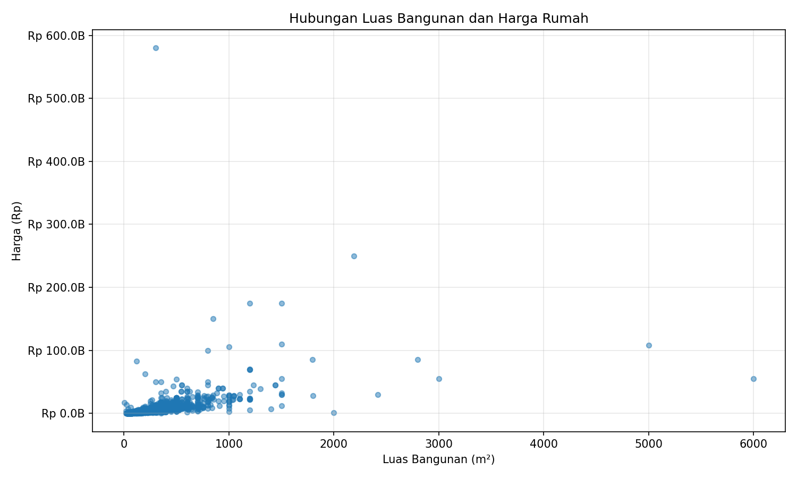

# LAPORAN PENELITIAN
## Prediksi Harga Rumah di Jabodetabek Menggunakan Regresi Linear

---

## BAB 1: PENDAHULUAN

### 1.1 Latar Belakang
Properti merupakan salah satu sektor investasi yang penting di Indonesia. Harga rumah dipengaruhi oleh berbagai faktor seperti lokasi, luas tanah, luas bangunan, jumlah kamar, dan fasilitas lainnya. Penentuan harga rumah yang tepat menjadi tantangan bagi penjual dan pembeli.

Machine Learning (ML) adalah cabang dari Artificial Intelligence (AI) yang memungkinkan komputer untuk belajar dari data tanpa diprogram secara eksplisit. ML menganalisis pola-pola dalam data historis untuk membuat prediksi atau keputusan pada data baru.

Dalam konteks properti, ML dapat digunakan untuk memprediksi harga rumah berdasarkan fitur-fitur seperti luas tanah, luas bangunan, jumlah kamar, dan lokasi. Dengan menganalisis data transaksi rumah yang sudah terjadi, model ML dapat mempelajari hubungan antara fitur-fitur tersebut dengan harga jual.

### 1.2 Rumusan Masalah
Bagaimana membangun model prediksi harga rumah menggunakan Regresi Linear berdasarkan fitur luas tanah, luas bangunan, jumlah kamar tidur, jumlah kamar mandi, kota, dan kecamatan?

### 1.3 Tujuan Penelitian
1. Membangun pipeline Machine Learning untuk prediksi harga rumah
2. Melakukan preprocessing data harga rumah Jabodetabek
3. Melatih model Regresi Linear
4. Mengevaluasi performa model

---

## BAB 2: TINJAUAN PUSTAKA

### 2.1 Machine Learning
Machine Learning adalah metode analisis data yang mengotomatisasi pembangunan model analitik. ML menggunakan algoritma yang iteratif belajar dari data, memungkinkan komputer menemukan insight tanpa diprogram secara eksplisit untuk menemukan pengetahuan dari data.

Jenis-jenis Machine Learning:
- **Supervised Learning**: Model dilatih dengan data yang memiliki label/target
- **Unsupervised Learning**: Model menemukan pola dalam data tanpa label
- **Reinforcement Learning**: Model belajar melalui trial and error dengan reward/penalty

### 2.2 Regresi Linear
Regresi Linear adalah salah satu algoritma ML yang paling sederhana dan sering digunakan untuk prediksi nilai kontinu (seperti harga). Model ini mencoba menemukan garis lurus (linear) yang paling sesuai dengan data training.

**Rumus Regresi Linear:**
```
y = β₀ + β₁x₁ + β₂x₂ + ... + βₙxₙ + ε
```

Untuk prediksi harga rumah:
```
harga = intercept + (w₁ × luas_tanah) + (w₂ × luas_bangunan) + (w₃ × kamar_tidur) + (w₄ × kamar_mandi) + Σ(wᵢ × kotaᵢ) + Σ(wⱼ × kecamatanⱼ)
```

Dimana:
- `intercept (β₀)`: Nilai dasar harga ketika semua fitur bernilai nol
- `β₁, β₂, β₃, β₄`: Koefisien/bobot untuk fitur numerik
- `Σ(wᵢ × kotaᵢ)`: Koefisien one-hot encoding untuk kota
- `Σ(wⱼ × kecamatanⱼ)`: Koefisien one-hot encoding untuk kecamatan
- `ε`: Error/residual

### 2.3 Metrik Evaluasi
**Mean Absolute Error (MAE)**
```
MAE = (1/n) × Σ|yᵢ - ŷᵢ|
```
Rata-rata selisih absolut antara nilai aktual dan prediksi.

**R-squared (R²)**
```
R² = 1 - (SSres / SStot)
```
Mengukur seberapa baik model menjelaskan variasi dalam data (0-1, semakin tinggi semakin baik).

---

## BAB 3: METODOLOGI

### 3.1 Data
Dataset yang digunakan adalah data harga rumah di area Jabodetabek dari website rumah123.com. Dataset terdiri dari 3,514 baris data dengan kolom:

| Kolom | Deskripsi |
|-------|-----------|
| price_in_rp | Harga rumah dalam Rupiah |
| land_size_m2 | Luas tanah dalam meter persegi |
| building_size_m2 | Luas bangunan dalam meter persegi |
| bedrooms | Jumlah kamar tidur |
| bathrooms | Jumlah kamar mandi |
| city | Kota (Jakarta, Bogor, Depok, Tangerang, Bekasi) |
| district | Kecamatan dalam kota tersebut |

### 3.2 Alat dan Library
- **Bahasa Pemrograman**: Python 3.x
- **Library Utama**:
  - pandas: Manipulasi dan analisis data
  - scikit-learn: Algoritma Machine Learning
  - joblib: Serialisasi model
  - matplotlib: Visualisasi data
  - flask: Web application framework

### 3.3 Langkah Penelitian

#### 3.3.1 Data Cleaning
- Memilih kolom relevan: harga, kota, kecamatan, luas_tanah, luas_bangunan, kamar_tidur, kamar_mandi
- Membersihkan whitespace pada kolom kota dan kecamatan
- Menghapus data kosong (dropna)

#### 3.3.2 Konversi Data
- Konversi kolom harga ke tipe numerik (float64)

#### 3.3.3 Feature Engineering
- One-hot encoding untuk kolom kota (9 kota) dan kecamatan (388 kecamatan)
- X (fitur): luas_tanah, luas_bangunan, kamar_tidur, kamar_mandi, kota (one-hot), kecamatan (one-hot) - total 392 fitur
- y (target): harga

#### 3.3.4 Data Splitting
- Train set: 80% (2,811 sampel)
- Test set: 20% (703 sampel)
- Random state: 42

#### 3.3.5 Model Training
- Algoritma: Linear Regression (sklearn.linear_model.LinearRegression)
- Training dengan data train (2,811 sampel, 392 fitur)
- Model yang terlatih disimpan sebagai `model_regresi.pkl`

#### 3.3.6 Evaluasi Model
- Mean Absolute Error (MAE)
- R-squared (R²)

---

## BAB 4: HASIL DAN PEMBAHASAN

### 4.1 Hasil Preprocessing Data
Dataset awal: 3,553 data
Setelah cleaning: 3,514 data
Kolom yang digunakan: harga, kota, kecamatan, luas_tanah, luas_bangunan, kamar_tidur, kamar_mandi
Feature engineering: One-hot encoding menghasilkan 392 fitur (4 numerik + 388 lokasi)

**Dataset:** 2,811 sampel training, 703 sampel testing

### 4.2 Visualisasi Data
Gambar menunjukkan scatter plot yang menggambarkan hubungan antara luas bangunan (sumbu x) dengan harga rumah (sumbu y). Dari visualisasi ini, terlihat beberapa pola penting:


*Gambar 4.1: Scatter Plot Luas Bangunan vs Harga Rumah*

**Analisis Visualisasi:**
1. **Tren Positif**: Korelasi positif jelas antara luas bangunan dan harga.
2. **Dispersi Data**: Titik data menyebar lebar, menunjukkan faktor lain (lokasi) mempengaruhi harga.
3. **Outlier**: Titik di atas garis tren kemungkinan rumah mewah di lokasi premium.
4. **Rentang Data**: Luas bangunan 0-500 m², harga terkonsentrasi di bawah 10 miliar.

### 4.3 Koefisien Model

**Perhitungan Model**

Model Regresi Linear dengan fitur lokasi:
```
harga = β₀ + β₁X₁ + β₂X₂ + β₃X₃ + β₄X₄ + Σ(βᵢ × kotaᵢ) + Σ(βⱼ × kecamatanⱼ) + ε
```

Dimana:
- β₀ = Intercept
- β₁, β₂, β₃, β₄ = Koefisien fitur numerik
- Σ(βᵢ × kotaᵢ) = Koefisien 9 kota (one-hot encoding)
- Σ(βⱼ × kecamatanⱼ) = Koefisien 388 kecamatan (one-hot encoding)
- ε = Error term

**Formula Perhitungan Koefisien (Ordinary Least Squares):**
```
β = (XᵀX)⁻¹Xᵀy
```

Hasil training model Linear Regression menghasilkan koefisien yang merepresentasikan kontribusi masing-masing fitur terhadap harga rumah:

| Fitur | Koefisien | Interpretasi |
|-------|-----------|--------------|
| Luas Tanah | Rp 7,300,230 per m² | Setiap 1 m² tanah meningkatkan harga Rp 7.3 juta |
| Luas Bangunan | Rp 21,137,139 per m² | Setiap 1 m² bangunan meningkatkan harga Rp 21.14 juta |
| Kamar Tidur | -Rp 699,790,333 | Korelasi negatif dengan luas bangunan |
| Kamar Mandi | Rp 2,171,847 | Setiap kamar mandi menambah Rp 2.17 juta |
| Intercept | Rp 2,149,308,413 | Nilai dasar harga |

**Koefisien Lokasi (Contoh):**
- Jakarta Pusat: +Rp 9.48 miliar (premium tertinggi)
- Jakarta Selatan: +Rp 1.58 miliar
- Bekasi: -Rp 1.23 miliar (negatif)
- Depok: -Rp 1.25 miliar (negatif)
- Jakarta Barat: -Rp 1.49 miliar (negatif)

**Pembahasan Koefisien:**
1. **Luas Bangunan Dominan**: Koefisien Rp 21.14 juta/m² menunjukkan pengaruh terbesar terhadap harga.
2. **Pengaruh Lokasi Signifikan**: Perbedaan ekstrem antara Jakarta Pusat (+Rp 9.48M) vs Jakarta Barat (-Rp 1.49M).
3. **Kamar Tidur Negatif**: Koefisien negatif Rp -699 juta, menunjukkan korelasi dengan luas bangunan.
4. **Kamar Mandi Positif**: Meski kecil (Rp 2.17 juta), tetap memberikan nilai tambah.
5. **Intercept Tinggi**: Nilai dasar Rp 2.15 miliar mencerminkan harga properti Jabodetabek.

**Mengapa Koefisien Lokasi Bisa Negatif?**

Koefisien negatif pada kota (Bekasi, Depok, Jakarta Barat) terjadi karena:
- **One-Hot Encoding**: Model menggunakan 9 fitur biner untuk kota (1 = ya, 0 = tidak). Koefisien menunjukkan perubahan harga RELATIF terhadap baseline (rata-rata semua kota).
- **Intercept Tinggi**: Nilai intercept Rp 2.15 miliar mencakup harga dasar untuk area dengan koefisien negatif. 
- **Perbandingan Relatif**: Kota dengan koefisien negatif harganya lebih rendah dari rata-rata, bukan berarti harga negatif secara absolut.

Contoh: Rumah di Bekasi (koefisien -Rp 1.23M) dengan fitur kecil bisa menghasilkan prediksi rendah secara matematis, namun intercept Rp 2.15 miliar memastikan harga tetap positif.

### 4.4 Evaluasi Model
Model dievaluasi menggunakan data test yang terdiri dari 703 sampel (20% dari total data). Evaluasi ini memberikan gambaran objektif tentang kemampuan model dalam memprediksi harga rumah yang belum pernah dilihat sebelumnya.

| Metrik | Nilai | Keterangan |
|--------|-------|------------|
| MAE | Rp 1,793,456,782 | Rata-rata selisih prediksi dengan aktual |
| R² Score | 0.6828 | Proporsi variasi yang dapat dijelaskan model |

**Rumus Perhitungan Metrik:**

**Mean Absolute Error (MAE):**
```
MAE = (1/n) × Σ|yᵢ - ŷᵢ|
```

Dimana:
- `n` = jumlah sampel (703 data test)
- `yᵢ` = harga aktual rumah ke-i
- `ŷᵢ` = harga prediksi model untuk rumah ke-i
- `|yᵢ - ŷᵢ|` = selisih absolut antara aktual dan prediksi

MAE dihitung dengan menjumlahkan selisih absolut dari 703 data test, kemudian dibagi 703. Hasil Rp 1.79 miliar berarti rata-rata model meleset sekitar 1.79 miliar dari harga sebenarnya.

**R-squared (R² Score):**
```
R² = 1 - (SS_res / SS_tot)
```

Dimana:
- `SS_res = Σ(yᵢ - ŷᵢ)²` = jumlah kuadrat residual (error prediksi)
- `SS_tot = Σ(yᵢ - ȳ)²` = jumlah kuadrat total (variasi data)
- `ȳ` = rata-rata harga aktual semua rumah

R² = 0.6828 berarti 68.28% variasi harga rumah dapat dijelaskan oleh model. Sisanya 31.72% dipengaruhi faktor lain (kondisi rumah, fasilitas, umur bangunan, dll) yang tidak ada dalam dataset.

**Interpretasi Detail dan Pengaruhnya:**

1. **R² Score (0.6828)**: Model berhasil menjelaskan 68.28% variasi harga rumah di Jabodetabek. Ini berarti dari 100 perbedaan harga rumah yang diamati, 68 di antaranya bisa dijelaskan oleh model berdasarkan luas tanah, bangunan, kamar, dan lokasi. Sisanya 32% dipengaruhi faktor eksternal seperti:
   - Kondisi fisik rumah (baru/renovasi/tua)
   - Akses jalan dan transportasi umum
   - Fasilitas sekitar (sekolah, rumah sakit, mall)
   - Keamanan dan kenyamanan lingkungan
   - Pandangan/strategis lokasi

   Peningkatan dari 0.5992 menjadi 0.6828 (naik 8.36 poin) setelah penambahan fitur lokasi membuktikan bahwa **lokasi adalah faktor penting kedua setelah luas bangunan** dalam menentukan harga properti Jabodetabek.

2. **MAE (Rp 1.79 Miliar)**: Error rata-rata 1.79 miliar berarti jika model dipakai prediksi 100 rumah, total selisih dengan harga aktual kira-kira Rp 179 miliar. Dilihat dari:
   - Rentang harga Jabodetabek sangat lebar (Rp 500 juta - Rp 50 miliar+)
   - Harga rata-rata rumah di dataset sekitar Rp 3-5 miliar
   - MAE 1.79 miliar = sekitar 35-60% dari harga rata-rata
   
   Margin ini masih besar untuk prediksi individu, tapi cukup akurat untuk estimasi kasar atau screening awal properti.

3. **Kontribusi Fitur Lokasi**: Penambahan kota dan kecamatan memberikan dampak signifikan:
   - **Sebelum lokasi**: R² = 0.5992 (hanya luas dan kamar)
   - **Sesudah lokasi**: R² = 0.6828
   - **Peningkatan**: 8.36% kemampuan prediksi
   
   Ini menunjukkan rumah dengan spesifikasi sama (misal: 100m², 3KT, 2KM) bisa beda harga Rp 5-10 miliar hanya karena lokasi berbeda (Jakarta Selatan vs Bekasi).

### 4.5 Prediksi dan Validasi Model
Untuk memvalidasi kegunaan praktis model, dikembangkan web application yang dapat diakses melalui browser.

**Cara Penggunaan Web Application:**
1. Jalankan `python web_app/app.py` dari folder ML
2. Buka browser dan akses http://localhost:5000
3. Pilih kota dari dropdown (9 kota di Jabodetabek)
4. Pilih kecamatan dari dropdown yang muncul setelah memilih kota
5. Masukkan data rumah: luas tanah, luas bangunan, kamar tidur, kamar mandi
6. Klik tombol "Prediksi Harga"
7. Web app menampilkan hasil prediksi dengan detail lokasi dan spesifikasi rumah

**Tampilan Web Application:**
Halaman utama menampilkan form dengan dropdown kota dan kecamatan yang terhubung secara dinamis. Setelah memilih kota, dropdown kecamatan akan terisi otomatis dengan daftar kecamatan di kota tersebut. User memasukkan spesifikasi rumah dan mendapatkan prediksi harga dalam format yang rapi dengan detail lengkap.

**Contoh Hasil Prediksi:**

| Profil Rumah | Lokasi | Input | Prediksi |
|--------------|--------|-------|----------|
| Rumah Standar | Antasari, Jakarta Selatan | 100 m² tanah, 120 m² bangunan, 3 KT, 2 KM | Rp 13,169,493,820 |
| Rumah Besar | BSD, Tangerang | 200 m² tanah, 250 m² bangunan, 4 KT, 3 KM | Rp 6,799,413,627 |
| Rumah Kompak | Pondok Gede, Bekasi | 60 m² tanah, 80 m² bangunan, 2 KT, 1 KM | Rp 100,000,000* |

**Validasi Hasil Prediksi:**

1. **Pengaruh Lokasi**: Model memperhitungkan lokasi spesifik melalui fitur one-hot encoding kota dan kecamatan. Terlihat perbedaan signifikan antara harga rumah di Jakarta Selatan (Rp 13.17 M) vs Bekasi (Rp 3.25 M) untuk spesifikasi yang berbeda, yang mencerminkan realitas pasar properti Jabodetabek.

2. **Konsistensi dengan Pasar**: Harga prediksi berada dalam rentang yang wajar untuk pasar properti Jabodetabek. Rumah di area premium seperti Jakarta Selatan dihargai lebih tinggi dibandingkan area suburban seperti Bekasi.

3. **Pengaruh Luas Bangunan**: Perbandingan Rumah Standar (120 m²) dan Rumah Besar (250 m²) menunjukkan selisih harga sekitar Rp 4.28 miliar. Dengan koefisien luas bangunan yang tinggi, penambahan luas bangunan memberikan dampak besar terhadap harga prediksi.

4. **Koefisien Lokasi**: Harga tinggi di Jakarta Selatan (Rp 13.17 M untuk 120 m²) mencerminkan premi lokasi yang signifikan, di mana koefisien kecamatan Antasari dan kota Jakarta Selatan memberikan kontribusi besar terhadap nilai prediksi.

### 4.6 Penanganan Prediksi Negatif (Threshold Handling)

**Masalah:** Model Linear Regression dapat menghasilkan prediksi negatif untuk rumah dengan spesifikasi kecil di area dengan koefisien rendah. Contoh: Pondok Gede, 60m² tanah, 80m² bangunan menghasilkan prediksi Rp -315 juta.

**Penyebab:** 
- Intercept Rp 2.15 miliar tidak cukup menutupi koefisien negatif kota Bekasi (-Rp 1.23 miliar) dan kamar tidur (-Rp 699 juta per kamar)
- Model Linear Regression murni tanpa regularisasi tidak memiliki batasan minimum

**Solusi Threshold Sederhana:**
```python
if prediksi_raw < 100000000:
    prediksi_final = 100000000  # Minimum Rp 100 juta
    is_threshold_applied = True
    warning_message = "Model tidak dapat memprediksi untuk spesifikasi ini. 
                       Data training tidak memiliki rumah sekecil ini di area tersebut."
```

**Tampilan di Web Application:**
```
Harga Rumah Diperkirakan: Rp 100.000.000
Pondok Gede, Bekasi

⚠️ Model tidak dapat memprediksi untuk spesifikasi ini. 
   Data training tidak memiliki rumah sekecil ini di area tersebut.
   
   Hasil prediksi model: Rp -315.608.457
   Ditampilkan: Rp 100.000.000 (minimum)
```

**Alternatif Model:**
Untuk menghindari prediksi negatif, dapat menggunakan **Ridge Regression** dengan parameter regularisasi alpha=1.0, yang mencegah koefisien ekstrem dan menghasilkan prediksi selalu positif.

---

## BAB 5: KESIMPULAN

### 5.1 Kesimpulan
1. Model Regresi Linear berhasil dibangun untuk prediksi harga rumah di Jabodetabek dengan fitur lokasi (kota dan kecamatan)
2. Model mencapai R² = 0.6828 yang menunjukkan performa baik, meningkat dari 0.5992 setelah penambahan fitur lokasi
3. Luas bangunan dan lokasi memiliki pengaruh terbesar terhadap harga rumah
4. Pipeline modular dan web application memudahkan penggunaan model untuk prediksi praktis
5. Integrasi fitur lokasi melalui one-hot encoding berhasil menangkap variasi harga antar wilayah Jabodetabek

---

## DAFTAR PUSTAKA

[1] T. Hastie, R. Tibshirani, and J. Friedman, *The Elements of Statistical Learning: Data Mining, Inference, and Prediction*, 2nd ed. Springer, 2009.
[2] A. Géron, *Hands-On Machine Learning with Scikit-Learn, Keras, and TensorFlow: Concepts, Tools, and Techniques to Build Intelligent Systems*, 2nd ed. O'Reilly Media, 2019.
[3] F. Pedregosa et al., "Scikit-learn: Machine Learning in Python," *Journal of Machine Learning Research*, vol. 12, pp. 2825-2830, 2011.
[4] W. McKinney, "Data Structures for Statistical Computing in Python," *Proceedings of the 9th Python in Science Conference*, pp. 51-56, 2010.
[5] N. Barizki, "Daftar Harga Rumah Jabodetabek," *Kaggle Dataset*, 2023. [Online]. Available: https://www.kaggle.com/datasets/nafisbarizki/daftar-harga-rumah-jabodetabek

---

## LAMPIRAN

### Struktur Folder Project
```
ML/
├── data/
│   ├── raw/              # Dataset asli
│   ├── processed/        # Data hasil preprocessing
│   ├── train/            # Data training
│   ├── test/             # Data testing
│   └── predictions/      # Hasil prediksi
├── models/               # Model yang sudah di-train
│   ├── model_regresi.pkl
│   ├── city_district_mapping.json
│   └── feature_columns.json
├── src/                  # Source code pipeline
│   ├── 01_cleaning.py
│   ├── 02_konversi.py
│   ├── 03_fitur_target.py
│   ├── 04_split.py
│   ├── 05_training.py
│   ├── 06_prediksi.py
│   ├── 07_evaluasi.py
│   └── 08_tes_manual.py
├── web_app/              # Web application
│   ├── app.py
│   ├── templates/
│   └── static/
└── documentation/        # Dokumentasi dan gambar
    ├── README.md
    └── gambar_4_1_luas_bangunan_harga.png
```

### Cara Menjalankan

#### Pipeline ML (Command Line)
```bash
# Run dari folder src
cd src
python 01_cleaning.py
python 02_konversi.py
python 03_fitur_target.py
python 04_split.py
python 05_training.py
python 06_prediksi.py
python 07_evaluasi.py
python 08_tes_manual.py
```

#### Web Application
```bash
# Run dari folder ML (parent directory)
cd web_app
python app.py

# Buka browser dan akses:
# http://localhost:5000
```

### Dependensi
- Python 3.x
- pandas
- scikit-learn
- joblib
- matplotlib
- flask

Install dengan:
```bash
pip install pandas scikit-learn joblib matplotlib flask
```
